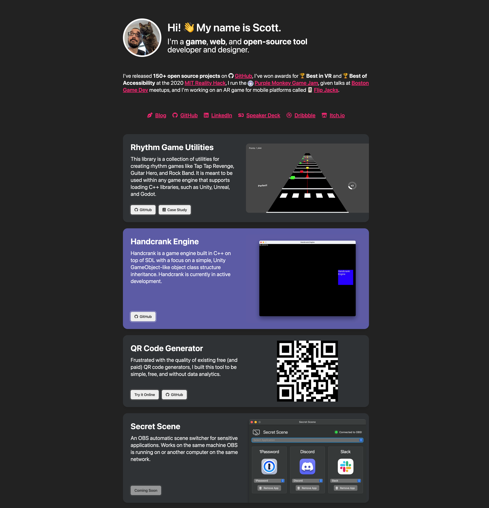

# scottdoxey.com

[](https://github.com/neogeek/scottdoxey.com/actions/workflows/deploy.workflow.yml)

<a href="./screenshot.png"></a>

## Development

### Building Site

This site uses the NPM package [onlybuild](https://github.com/neogeek/onlybuild).

```bash
$ npm run build
```

### Running Local Server

```bash
$ make serve
```

## Converting Videos

Convert files into both `mp4` and `webm` formats. Then, take a screenshot from one of the converted videos and save it as a poster image for the `<video>` tag.

```bash
ffmpeg -i "handcrank-demo.mov" -vf "scale=min(1000\,iw):-2" -c:v libx264 -preset veryslow -an "handcrank-demo.mp4"
ffmpeg -i "handcrank-demo.mov" -vf "scale=min(1000\,iw):-2" -preset veryslow -an "handcrank-demo.webm"
```
