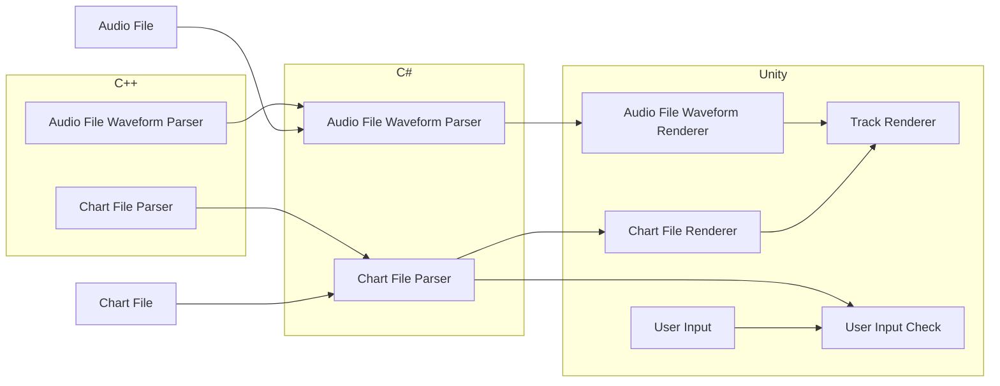

# Rhythm Game Prototype

> **Role:** Programmer

## Summary

I've been fascinated with music games for a very long time. From my first time playing [Tap Tap Revenge](https://en.wikipedia.org/wiki/Tap_Tap_Revenge) on my first iPod Touch to the countless hours I've played either Guitar Hero or Rock Band with friends. Because of this fascination, it makes sense that I would find myself building a game with a music component.

## Objectives

My main objective was to be able to build a small core set of features:

- Parse a file containing notes
- Display those notes on a track
- Sync the track movement with the audio file associated with it
- Capture player input and detect if a note was hit

My secondary objective was to make it so you could use any device to play the game. This could prove to be very complicated as it would require a lot of manual testing on devices. The current list of devices:

- Keyboard
- Gamepad Controller
- MIDI Controller (keyboard/drum/etc)
- Guitar Hero / Rock Band Guitars
- DDR Pads

## Implementation

To create this prototype, I had one specific requirement I wanted to adhere to: create as much of the logic in C++ and C# as possible. This would allow the majority of the project to be built and tested outside of Unity. It would also have the added benefit of being portable to other engines.

I also wanted to make sure the song files were stable. At first, I started authoring song files based on a custom file format I created. I quickly realized what I was building wouldn't cut it and needed to be reworked. While looking for inspiration online, I learned about Clone Hero, a rhythm game similar to Guitar Hero and Rock Band, and their custom file format: chart files. The more I learned about them, the more I realized they were my prototype's only choice for storing songs.

The basic architecture for this prototype would look like this:

## Results

<iframe width="560" height="315" src="https://www.youtube-nocookie.com/embed/WSMoc8Y1FOE?si=yG__n1fUNcQMQ2_n" title="YouTube video player" frameborder="0" allow="accelerometer; autoplay; clipboard-write; encrypted-media; gyroscope; picture-in-picture; web-share" referrerpolicy="strict-origin-when-cross-origin" allowfullscreen></iframe>

## Challenges and Solutions

## References

1. [Tap Tap Revenge](https://en.wikipedia.org/wiki/Tap_Tap_Revenge) - _Tap Tap Revenge (also known as Tap Tap Revenge Classic) was a music game created by Nate True, and developed and published by Tapulous for iOS in July 2008. It is the first game in Tapulous' Tap Tap series._
1. [Guitar Hero](https://en.wikipedia.org/wiki/Guitar_Hero) - _Guitar Hero is a series of music rhythm games first released in 2005, in which players use a guitar-shaped game controller to simulate playing primarily lead, bass, and rhythm guitar across numerous songs._
1. [Rock Band](https://en.wikipedia.org/wiki/Rock_Band) - _Rock Band is a series of rhythm games first released in 2007 and developed by Harmonix. Based on their previous development work from the Guitar Hero series [...]_
1. [Clone Hero](https://clonehero.net/) - _Clone Hero is a classic instrument based rhythm game for Windows, Mac, Linux, and Android. It's playable with any 5 or 6 fret guitar controller, any midi drum kit, any game controller and even your keyboard! Jam out with Drums, 5-fret Guitar, or 6-fret Guitar online or local!_
1. [Moonscraper](https://github.com/FireFox2000000/Moonscraper-Chart-Editor) - _Moonscraper Chart Editor is a song editor for Guitar Hero style rhythm games mainly intended to support the custom song creation for games such as Guitar Hero, Clone Hero and Rock Band._
1. [.chart File Format](https://github.com/TheNathannator/GuitarGame_ChartFormats/blob/main/doc/FileFormats/.chart/Core%20Infrastructure.md) - _.chart is a text-based custom chart format originating from the GH1/2 era, similar in form to .ini files. It was originally created as an intermediate format, meant to be converted for use in a game, but nowadays it is typically used directly._
