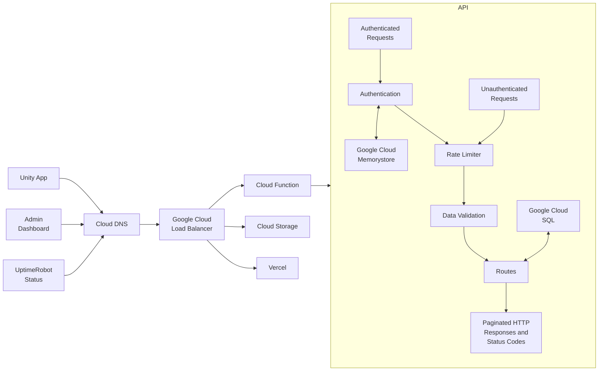

# Tangle


> **Role:** Programmer, Designer, Dev Ops

## Summary

Tangle's original implementation goal was to create a simple authentication system allowing a single user account to log into different Unity applications, similar to Battle.net's authentication system. It soon grew into a complex system that supported schema-less data stores, server management, file uploads, payment processing, and more.

## Objectives

-   Allow users to log into Tangle and join a server where other members are also using Tangle.
-   Allow users to create post-its, image uploads, links, etc and have that data be visible to other users as well a persist.
-   Allow users to manage servers and their memberships.
-   Allow users to invite users to servers and those users to accept or decline invites.
-   Allow users to manage subscription payments via third party payment processing.
-   Ensure users information is secure and that they only have access to the information they allowed to access and modify.
-   Ensure users connections to the audio/video servers are secure using authentication webhooks.

## Implementation

<div class="multiple-images">
    
    
</div>

## Stats

<div class="stats">
    <ul>
        <li><span>78,000+</span> Total Logins</li>
        <li><span>1,100+</span> Unique Users</li>
        <li><span>350+</span> Unique Servers</li>
    </ul>
    <ul>
        <li><span>500+</span> Users Joined Waitlist</li>
        <li><span>22,000+</span> Objects Created on Servers</li>
    </ul>
</div>

## Results



## Challenges and Solutions

### Custom Rate Limiter

While our target client base was employees of a remote studio, users could always use Tangle within the same building, similar to users of Zoom or Microsoft Teams. We also needed a solution that would work via a REST API in a Unity client, not a backend relying on session data.

We opted for a simple IP address hash first and a user UUID hash second. This method allowed authenticated users to be isolated from unauthenticated users sharing the same IP address.

While this was a simple solution, some things needed to be set up before it would work correctly in our environment.

First, we hosted our API on Google Cloud Functions, which could spin up multiple instances, meaning we couldn't rely on any local or ephemeral data stores. We used Redis to store these hashed keys, the number of failed attempts, and a TTL for the key/value pair.

We also needed to set up Express.js to allow the user's IP address to pass to the API. This fix required a simple flag set in the main route setup file.

```typescript
app.set('trust proxy', true);
```

We also wanted to make sure rate limiting didn't affect local development or unit tests.

```typescript
rateLimiterGenerator({
    ignoreErrors: process.env.NODE_ENV === 'development'
});
```

Finally, we separated our routes into two categories: one for unauthenticated routes and one for authenticated routes. The unauthenticated routes naturally had stricter rules. The authenticated routes were more lax and were balanced based on metrics gathered during normal usage.

All routes returned valid headers to allow the dashboard and Unity client to react if there was an issue with rate limits reached or exceeded.

### Error Codes

We needed an error code system that would work in both the API (TypeScript) and the Unity client (C#). We went with a hexadecimal system and set up the system to use ranges for each section.

The `ErrorCode` enum was duplicated from the TypeScript API to the C# DLL included in the Unity client. While the `HumanReadableErrorCode` existed only in the API. This was to limit the localization logic to the API. An endpoint was available via the API that returned the `HumanReadableErrorCode` values and mapped them to the C# enum keys.

```typescript
/* eslint-disable no-magic-numbers */
export enum ErrorCode {
    INVALID = -1,
    INVALID_INPUT = 0x0001, // 1
    RATE_LIMIT_REACHED = 0x0002, // 2
    // Authentication=
    INVALID_EMAIL_ADDRESS = 0x1001, // 4097
    INVALID_PASSWORD = 0x1002, // 4098
    INVALID_PASSWORD_RESET_TOKEN = 0x1003, // 4099
    NOT_AUTHORIZED = 0x1004 // 4100
}

export const HumanReadableErrorCode: { [key: number]: string } = {
    [ErrorCode.INVALID]: 'Unknown error.',
    [ErrorCode.INVALID_INPUT]: 'Invalid input.',
    [ErrorCode.RATE_LIMIT_REACHED]:
        'Whoa there, slow down! You have reached the limit of how many requests you can make.',
    // Authentication
    [ErrorCode.INVALID_EMAIL_ADDRESS]:
        'Invalid email address. Please check and try again.',
    [ErrorCode.INVALID_PASSWORD]:
        'Invalid password. Please check and try again.',
    [ErrorCode.INVALID_PASSWORD_RESET_TOKEN]:
        'Invalid password reset token. Please check and try again.',
    [ErrorCode.NOT_AUTHORIZED]: 'Not authorized.'
};
```

The plan was to add additional languages to the API errors once we started supporting additional languages in the client.

### Data Validation

For data validation we use the [zod](https://zod.dev/) validation library. We used it when data comes in to a route and again when it's passed to a controller. We do this to ensure the data is verified before anything happens in the API, either via a route or cron job.

This example of how we used the validation library is simplified for demo purposes.

```typescript
import { z } from 'zod';

export const STRING_MAX_LENGTH = 255;
export const MIN_PASSWORD_LENGTH = 8;

export const emailSchema = z
    .string()
    .trim()
    .toLowerCase()
    .email()
    .catch(() => {
        throw new Error(ErrorCode.INVALID_EMAIL_ADDRESS);
    });

export const passwordSchema = z
    .string()
    .trim()
    .max(STRING_MAX_LENGTH)
    .refine(val => {
        const isMinimumLength = val.length >= MIN_PASSWORD_LENGTH;
        const containsUppercaseLetter = val.match(/[A-Z]/);
        const containsLowercaseLetter = val.match(/[a-z]/);
        const containsNumber = val.match(/[0-9]/);
        const containsSpecialCharacter = val.match(
            /[~!@#$%^&*_\-+=`|\\(){}[\]:;"'<>,.?/]/g
        );

        return [
            isMinimumLength,
            containsUppercaseLetter,
            containsLowercaseLetter,
            containsNumber,
            containsSpecialCharacter
        ].every(Boolean);
    })
    .catch(() => {
        throw new Error(ErrorCode.INVALID_PASSWORD);
    });

export const signupSchema = z.object({
    emailAddress: emailSchema,
    createPassword: passwordSchema
});

export const loginSchema = z.object({
    emailAddress: emailSchema,
    password: z
        .string()
        .trim()
        .max(STRING_MAX_LENGTH)
        .min(1)
        .catch(() => {
            throw new Error(ErrorCode.INVALID_PASSWORD);
        })
});
```

```typescript
const validatedValues = loginSchema.parse({ emailAddress, password });
```

```typescript
const validatedValues = signupSchema.parse({
    emailAddress,
    createPassword: password
});
```

### Pagination

Each route that returns a list conforms to [HATEOAS](https://en.wikipedia.org/wiki/HATEOAS), returning the data as well as links to the current page and any next or previous pages. This allows for easy pagination via the dashboard as well as the Unity client. The API DLL created for the Unity client has helper utilities for automatically looping through the paginated requests to return all the results.

```json
{
  "data": [
    {
      "userId": 1,
      "name": "Scott"
    },
    ...
  ],
  "totalRows": 1000,
  "links": {
    "self": "/users/?offset=0&limit=100",
    "next": "/users/?offset=100&limit=100"
  }
}
```

### Emails

All emails sent from the API, welcome emails, server invites, password reset link, are all sent via a single email send API via [SendGrid](https://sendgrid.com/). The emails are designed locally using [MJML](https://mjml.io/) to simplify the creation of email as well as allowing us to maintain a local copy of all emails not stored directly in SendGrid.

```xml
<mjml>
  <mj-head>
    <mj-attributes>
      <mj-class name="body-text" font-size="16px" padding="0px 25px" line-height="1.5" font-family="helvetica" />
    </mj-attributes>
  </mj-head>
  <mj-body>
    <mj-section>
      <mj-column>
        <mj-image src="../../images/tangle_logo_dark_bg.jpg"></mj-image>

        <mj-text mj-class="body-text">
          <p>Hello!</p>
        </mj-text>

        <mj-text mj-class="body-text">
          <p>Someone has requested to reset the password for your Tangle account. If this was not you, disregard this email.</p>

          <p>To reset your password, click the following link (or paste into your browser) within the next 90 minutes:</p>
        </mj-text>

        <mj-text mj-class="body-text">
          <p>{{PASSWORD_RESET_LINK}}</p>
        </mj-text>

        <mj-text mj-class="body-text">
          <p>Happy Tangling!</p>

          <p>- The Tangle team</p>
        </mj-text>
      </mj-column>
    </mj-section>
  </mj-body>
</mjml>
```

When running the API locally or running tests, the SendGrid API is run in `sandboxMode` so no emails are actually sent.

### Automation

#### GitHub Actions

### Cross-team Collaboration

### Payment Processing

Payment processing ended up being a much larger task than we initially anticipated. The original concept was to use Stripe's no-code options to set up the subscription for owners of each server and manage the subscription directly via Stripe's admin dashboard. We quickly realized that there were two issues.

One was that when people signed up for a new account with a server, they didn't need to supply a credit card, but they needed a subscription in the system to set up a trial and a user account in Stripe with the server owner's email address. The other was that the subscription needed the server ID, membership count, and the server owner's user ID.

We figured out how to do this and prevent needing to interrupt the user trialing Tangle with payment processing information. Once the trial ran out, a message was displayed in the Unity client and the Tangle admin dashboard informing the user that they needed to add a form of payment via the dashboard.

Another issue was setting up logic to auto-update the server subscription membership quantity so the bill would prorate with the new membership quantity.

Another issue was allowing a server to transfer ownership to another user. The transfer process needed to reassign the ownership in Stripe and the Tangle backend.

These issues needed testing to ensure they worked and continued to work against the live Stripe service. To do this, we ran mock tests when merging code before deploying to development (or production). And then, we ran the same tests against the live service on a test account every night at midnight. This setup allowed us to iterate while ensuring no regressions occurred on Stripe's side.

### Testing

### API Versioning

## References
