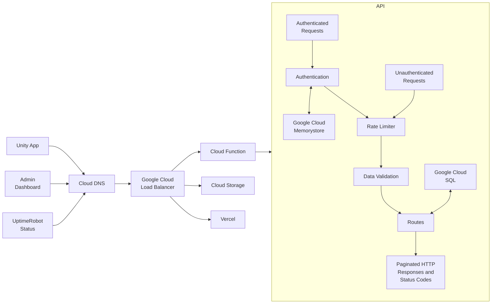

# Tangle


> **Role:** Programmer, Designer, Dev Ops

## Summary

Tangle's original implementation goal was to create a simple authentication system allowing a single user account to log into different Unity applications, similar to Battle.net's authentication system. It soon grew into a complex system that supported schema-less data stores, server management, file uploads, payment processing, and more.

## Objectives

-   Allow users to log into Tangle and join a server where other members are also using Tangle.
-   Allow users to create post-its, image uploads, links, etc and have that data be visible to other users as well a persist.
-   Allow users to manage servers and their memberships.
-   Allow users to invite users to servers and those users to accept or decline invites.
-   Allow users to manage subscription payments via third party payment processing.
-   Ensure users information is secure and that they only have access to the information they allowed to access and modify.
-   Ensure users connections to the audio/video servers are secure using authentication webhooks.

## Implementation

<div class="multiple-images">
    
    
</div>

## Stats

<div class="stats">
    <ul>
        <li><span>78,000+</span> Total Logins</li>
        <li><span>1,100+</span> Unique Users</li>
        <li><span>350+</span> Unique Servers</li>
    </ul>
    <ul>
        <li><span>500+</span> Users Joined Waitlist</li>
        <li><span>22,000+</span> Objects Created on Servers</li>
    </ul>
</div>

## Results



## Challenges and Solutions

### Custom Rate Limiter

While our target client base was employees of a remote studio, users could always use Tangle within the same building, similar to users of Zoom or Microsoft Teams. We also needed a solution that would work via a REST API in a Unity client, not a backend relying on session data.

We opted for a simple IP address hash first and a user UUID hash second. This method allowed authenticated users to be isolated from unauthenticated users sharing the same IP address.

While this was a simple solution, some things needed to be set up before it would work correctly in our environment.

First, we hosted our API on Google Cloud Functions, which could spin up multiple instances, meaning we couldn't rely on any local or ephemeral data stores. We used Redis to store these hashed keys, the number of failed attempts, and a TTL for the key/value pair.

We also needed to set up Express.js to allow the user's IP address to pass to the API. This fix required a simple flag set in the main route setup file.

```typescript
app.set('trust proxy', true);
```

We also wanted to make sure rate limiting didn't affect local development or unit tests.

```typescript
rateLimiterGenerator({
    ignoreErrors: process.env.NODE_ENV === 'development'
});
```

Finally, we separated our routes into two categories: one for unauthenticated routes and one for authenticated routes. The unauthenticated routes naturally had stricter rules. The authenticated routes were more lax and were balanced based on metrics gathered during normal usage.

All routes returned valid headers to allow the dashboard and Unity client to react if there was an issue with rate limits reached or exceeded.

### Error Codes

### Data Validation

### Emails

### Automation

#### GitHub Actions

### Cross-team Collaboration

### Payment Processing

### Testing

### API Versioning

## References
